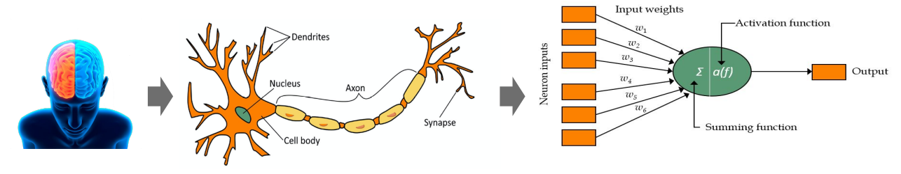
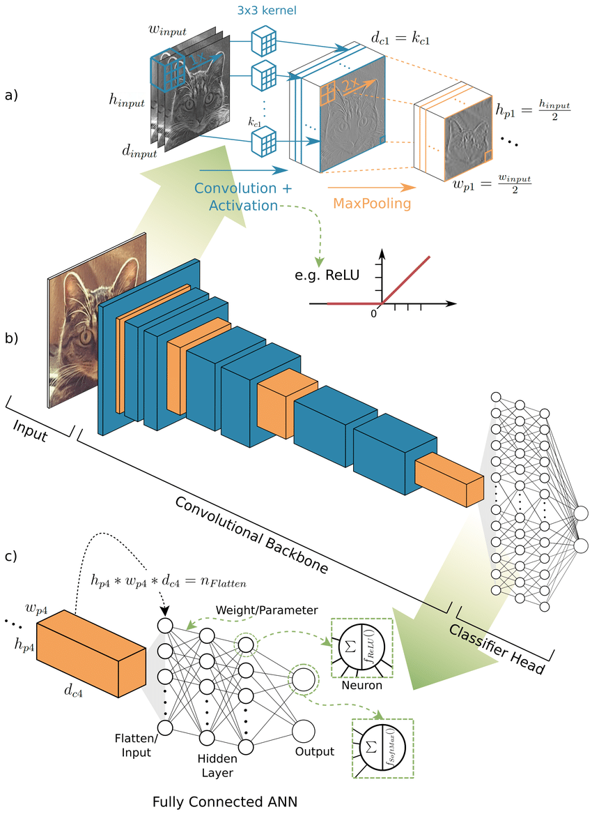
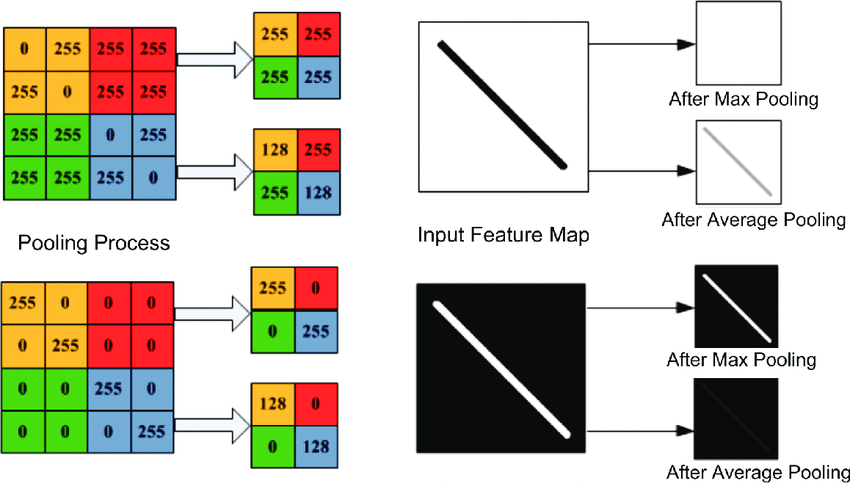
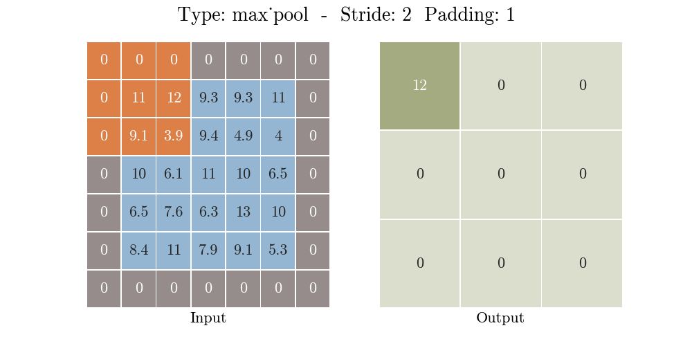
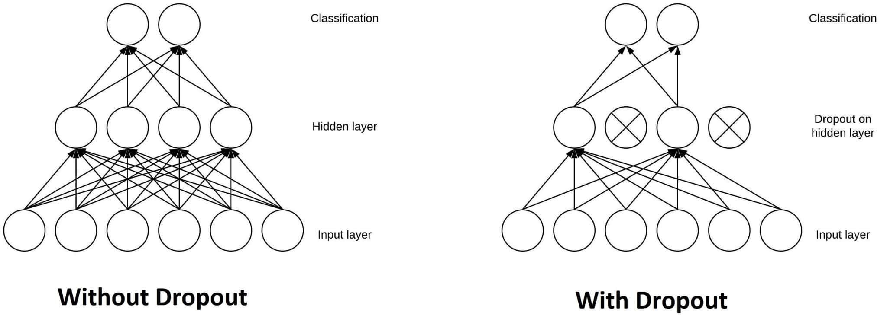

<h1 align="center">Image Classification</h1>

<div align="center">
    
</div>

<br>

## **1. Artificial Neural Network**

### **1.1. Definisi Artificial Neural Network (ANN)**

<div align="center">
    
</div>

Dalam Machine Learning, Neural Network yang juga disebut Jaringan Saraf Tiruan (JST) atau Artificial Neural Network (ANN) adalah model algoritma yang terinspirasi oleh struktur dan fungsi jaringan saraf biologis dalam otak hewan (termasuk manusia).

### **1.2. Arsitektur Artificial Neural Network (ANN)**

<div align="center">
    
</div>

Sebuah ANN terdiri dari unit-unit atau node-node yang saling terhubung yang disebut neuron buatan atau artificial neuron, yang secara teori meniru neuron-neuron di otak. Node-node ini dihubungkan oleh tepi-tepi (edges), yang meniru sinapsis di otak. Setiap neuron buatan menerima sinyal dari neuron-neuron yang terhubung, kemudian memprosesnya dan mengirimkan sinyal ke neuron-neuron lain yang terhubung. "Sinyal" tersebut adalah bilangan riil, dan keluaran dari setiap neuron dihitung oleh suatu fungsi non-linear dari jumlah inputnya, yang disebut fungsi aktivasi (activation function). Kekuatan sinyal di setiap koneksi ditentukan oleh sebuah bobot (weight), yang disesuaikan selama proses pembelajaran.

<div align="center">
    
</div>

Biasanya, neuron-neuron dikelompokkan ke dalam lapisan-lapisan. Lapisan-lapisan yang berbeda mungkin melakukan transformasi yang berbeda pada input mereka. Sinyal-sinyal bergerak dari lapisan pertama (lapisan input) ke lapisan terakhir (lapisan output), dan mungkin melewati beberapa lapisan antara (lapisan tersembunyi) yang disebut hidden layer. Suatu jaringan disebut deep neural network jika memiliki setidaknya dua hidden layer.

#### **1.2.1. Input Layer**

Lapisan input dari ANN terdiri dari neuron-neuron input yang membawa data awal ke dalam sistem untuk diproses lebih lanjut oleh lapisan-lapisan artificial neuron berikutnya. Lapisan input adalah awal dari alur kerja untuk ANN. Jumlah neuron input sama dengan jumlah fitur pada data input.

```python
tf.keras.Input(shape=[height, width, color_channels])
```

```python
tf.keras.layers.InputLayer(input_shape=(height, width, color_channels))
```

```python
tf.keras.layers.Conv2D(input_shape=(height, width, color_channels))
```

```python
tf.keras.layers.Flatten(input_shape=(height, width, color_channels))
```

```python
tf.keras.layers.Dense(input_shape=(height, width, color_channels))
```

- input_shape/shape → dimensi ruang input

#### **1.2.2. Hidden Layer**

Dalam Artificial Neural Network (ANN), `hidden layer` adalah lapisan neuron buatan yang dapat ditambahkan atau diterapkan dalam rancangan. Lapisan ini bukanlah lapisan input maupun lapisan output, lapisan ini berada di antara keduanya. Contoh dari ANN yang menggunakan hidden layer adalah `feedforward neural network`.

Hidden layer mengubah input dari lapisan input ke lapisan output. Dilakukan dengan cara menerapkan `weight` pada input dan melewatkannya melalui `activation function`, yang menghitung output berdasarkan input dan bobot tersebut. Proses ini memungkinkan ANN untuk mempelajari hubungan non-linear antara data input dan output. Bobot pada input dapat ditetapkan secara acak, dan juga dapat disesuaikan serta dikalibrasi melalui metode yang disebut `backpropagation`. Jumlah lapisan tersembunyi sebaiknya disesuaikan dengan kompleksitas permasalahan yang dihadapi.

- Semakin banyak jumlah lapisan (layer), semakin banyak waktu komputasi yang dibutuhkan.
- Semakin banyak jumlah node (neuron), semakin memungkinkan ANN untuk mempelajari pola yang lebih rumit.
- Untuk mencegah `overfitting`, jumlah node (neuron) sebaiknya ditambahkan secara bertahap.

    ```python
    tf.keras.layers.Dense(units, activation=None)
    ```

    - units → dimensi ruang output
    - activation → fungsi aktivasi untuk digunakan, misalnya ReLu

#### **1.2.3. Output Layer**

Lapisan output pada artificial neural network adalah lapisan terakhir yang menghasilkan prediksi atau hasil akhir dari model. Lapisan ini menerima input dari hidden layer sebelumnya, mengolahnya, dan mengeluarkan hasil yang digunakan untuk menentukan keputusan atau klasifikasi akhir. Jumlah neuron disesuaikan dengan permasalahan yang dihadapi.

- Untuk klasifikasi `binary dan regresi`, output layer terdiri dari `satu neuron`.
- Untuk klasifikasi `multiclass atau categorical`, output layer terdiri dari jumlah neuron yang sama dengan `jumlah class`.

    ```python
    tf.keras.layers.Dense(units, activation='sigmoid')
    ```

    - units → dimensi ruang output
        - binary → satu neuron.
        - categorical → jumlah neuron sesuai jumlah class
    - activation → fungsi aktivasi yang digunakan

        | activation | output/class mode | loss function                             |
        | ---------- | ----------------- | ----------------------------------------- |
        | sigmoid    | binary            | binary_crossentropy → 0/1                 |
        | softmax    | categorical       | categorical_crossentropy → [1 0] [0 1]    |
        | softmax    | categorical       | sparse_categorical_crossentropy → [0] [1] |

Artificial Neural Network digunakan untuk berbagai tugas, termasuk pemodelan prediktif, kontrol adaptif, dan pemecahan masalah dalam kecerdasan buatan. Artificial Neural Network dapat belajar dari pengalaman, dan dapat menarik kesimpulan dari kumpulan informasi yang kompleks.

<br>

## **2. Convolutional Neural Network**

### **2.1. Definisi Convolutional Neural Network**

Convolutional Neural Network (CNN/ConvNet) merupakan bagian dari deep neural network, yakni jenis jaringan saraf tiruan yang umumnya digunakan dalam pengenalan dan pemrosesan gambar. Algoritma ini memiliki dua bagian utama yaitu bagian ekstraksi fitur dan bagian klasifikasi. Bagian ekstraksi fitur gambar dilakukan oleh Convolutional Backbone, sedangkan untuk bagian klasifikasi dilakukan oleh Classifier Head yang berisi Artificial Neural Network.

<div align="center">
    
</div>

### **2.2. Arsitektur Convolutional Neural Network**

#### **2.2.1. Convolution Layer**

Convolutional layer merupakan proses konvolusi citra input dengan filter yang menghasilkan `feature map` (fitur-fitur penting sebuah gambar memberikan informasi jauh lebih besar dibanding gambar input itu sendiri).

<div align="center">
    
</div>

Proses konvolusi citra dengan filter dilakukan `sliding filter` mulai dari kiri atas dari matrik citra sampai kanan bawah.

<div align="center">
    
</div>

Convolutional layer akan mencari kernel/weight yang tepat. Semakin banyak kernel maka semakin banyak jenis fitur. Tujuan Convolutional layer ditumpuk agar informasi yang didapatkan semakin lebih bermakna.

<div align="center">
    
    
</div>
<div align="center">
    
    
</div>

```python
tf.keras.layers.Conv2D(
    filters,
    kernel_size,
    strides=(1, 1),
    padding='valid',
    activation=None,
    input_shape=(height, width, color_channels)
)
```

- filters → dimensi ruang output → jumlah filter output dalam konvolusi
- kernel_size → ukuran spasial dari filter (lebar/tinggi)
- stride → besar pergeseran filter dalam konvolusi
- padding → jumlah penambahan nol pada gambar
    - valid → tidak ada padding
    - same → padding nol merata kiri/kanan/atas/bawah
- activation → fungsi aktivasi untuk digunakan
- input_shape → input gambar

#### **2.2.2. Batch Normalization**

Batch Normalization berperan untuk mengurangi pergeseran kovarian atau menyamakan distribusi setiap nilai input yang selalau berubah karena perubahan pada layer sebelumnya selama proses training.

<div align="center">
    
</div>

```python
tf.keras.layers.BatchNormalization()
```

#### **2.2.3. Pooling Layer**

Pooling layer berperan untuk memperkecil dimensi feature image (downsampling) dan menyimpan informasi penting.

<div align="center">
    
</div>

<div align="center">
    
    
</div>

```python
tf.keras.layers.MaxPool2D(
    pool_size=(2, 2),
    strides=None,
    padding='same',
)
```

```python
tf.keras.layers.AveragePooling2D(
    pool_size=(2, 2),
    strides=None,
    padding='same',
)
```

- pool_size → ukuran pool
- strides → besar pergeseran
- padding → jumlah penambahan nol pada gambar
    - valid → tidak ada padding
    - same → padding nol merata kiri/kanan/atas/bawah

#### **2.2.4. Visualisasi Proses Konvolusi dan Pooling pada Gambar**

Berikut adalah salah satu contoh bagaimana gambar anjing diproses setelah melewati Convolutional Backbone yang terdiri dari beberapa convolution layer dan max pooling layer. Terlihat pada gambar, fitur-fitur penting pada wajah anjing akan semakin muncul setelah dilakukan proses konvolusi dan pooling. Proses ini akan mempermudah model dalam mengenali gambar yang akan dilatih dan diprediksi nantinya.

<div align="center">
    
</div>

### **2.3. Classifier Head (ANN)**

<div align="center">
    
</div>

#### **2.3.1. Flatten dan Global Pooling**

Flatten dan Global Pooling berperan sebagai `input layer`.

<div align="center">
    
</div>

- Flatten → height * width * depth (1 dimension)

    ```python
    tf.keras.layers.Flatten()
    ```

- Global Pooling -> d (1 dimension)

    ```python
    tf.keras.layers.GlobalAveragePooling2D()
    ```

    ```python
    tf.keras.layers.GlobalMaxPool2D()
    ```

#### **2.3.2. Hidden Layer**

```python
tf.keras.layers.Dense(units, activation=None)
```

- units → dimensi ruang output
- activation → fungsi aktivasi untuk digunakan → relu

#### **2.3.3. Output Layer**

Jumlah neuron disesuaikan dengan permasalahan yang dihadapi.

- Untuk klasifikasi `binary dan regresi`, output layer terdiri dari `satu neuron`.
- Untuk klasifikasi `multiclass atau categorical`, output layer terdiri dari jumlah neuron yang sama dengan `jumlah class`.


    ```python
    tf.keras.layers.Dense(units, activation=None)
    ```

    - units → dimensi ruang output
        - binary → satu neuron.
        - categorical → jumlah neuron sesuai dengan jumlah kelas.
    - activation → fungsi aktivasi untuk digunakan

        | activation | output/class mode | loss function                             |
        | ---------- | ----------------- | ----------------------------------------- |
        | sigmoid    | binary            | binary_crossentropy → 0/1                 |
        | softmax    | categorical       | categorical_crossentropy → [1 0] [0 1]    |
        | softmax    | categorical       | sparse_categorical_crossentropy → [0] [1] |

<br>

## **3. Strategi Proses Training**

<div align="center">
    
</div>

### **3.1. Modifikasi Network**

- Merubah arsitektur, misalnya menambah jumlah hidden layer, jumlah neuron, atau jenis arsitektur lain.

    <div align="center">
        
    </div>

- Merubah fungsi aktivasi, misalnya menggunakan ReLU (apabila x ≤ 0 maka x = 0 dan apabila x > 0 maka x = x).

    <div align="center">
        
        
    </div>

### **3.2. [Optimasi parameter](https://www.tensorflow.org/api_docs/python/tf/keras/optimizers?version=nightly)**

Nilai learning rate berpengaruh pada perhitungan bobot baru, umumnya penggunaan learning rate yang menyesuaikan nilai gradien (adaptive learning rate) menunjukkan kinerja model yang lebih baik. Contoh algoritma adaptive learning rate seperti `Adagrad`, `Adadelta`, `Adam`, `AdaSecant`, dan `RMSprop`.

### **3.3. Mencegah Overfitting**

- Regularisasi dilakukan untuk mengurangi generalization error dengan mencegah model lebih kompleks.
    - [Regularization L1 norm dan Regularization L2](https://www.tensorflow.org/api_docs/python/tf/keras/regularizers) norm (weight decay)
- [Dropout](https://www.tensorflow.org/api_docs/python/tf/keras/layers/Dropout) adalah proses mencegah terjadinya overfitting dan juga mempercepat proses learning.

    <div align="center">
        
    </div>

    ```python
    tf.keras.layers.Dropout(rate)
    ```

- [Early Stopping](https://www.tensorflow.org/api_docs/python/tf/keras/callbacks/EarlyStopping) adalah iterasi pada saat training dihentikan jika `generalization error/loss validation` mulai naik.

- Augmentasi Data adalah menambah data training. Augmentasi data dapat dilakukan dengan menggunakan [Image Data Generator](https://www.tensorflow.org/api_docs/python/tf/keras/preprocessing/image/ImageDataGenerator).

<br>

<h2 align="center">Referensi Tambahan</h2>

- Visualisasi: [ANN](https://playground.tensorflow.org/)
- Visualisasi: [CNN Explainer](https://poloclub.github.io/cnn-explainer/)
